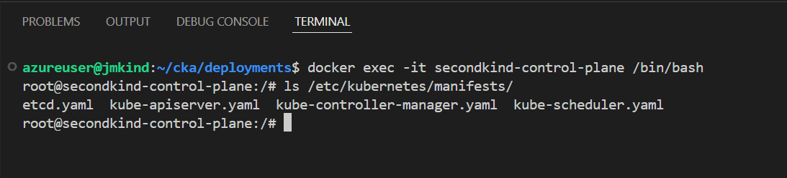

# CKA study helpers

In this repo I'm taking all my notes and I also provide some scripts to run a VM with 
[kind](https://kind.sigs.k8s.io/) and [vscode server](https://code.visualstudio.com/docs/remote/vscode-server)

This is not a guide, just my personal notes and exercises while studying for the CKA exam.

## Components

* Infra: scripts to deploy the VM
* kind: scripts to install all you need to run kind and vscode remotely on a VM
* deployments: example deployments from the course

## Install

Provide a token file that contains your security token (can be anything, by default a uuid will be created if you don't provide one) and run the installer. It will create an Azure VM with two NICs, one for the vscode server, with an IP and dns name, and another NIC for accessing the kind services.

You can run the deployment script with the following command:

```bash
azd up
```

Once installed you can access by using the url: https://[NAME].[REGION].cloudapp.azure.com/?token=[TOKEN]

## How to use it

The main access to this solution will be via vscode, where you have a secure shell connection to the VM. You can open the terminal and run commands on the VM, or you can use the vscode server to access the files and run commands.
Once installed, you will have a Kubernetes IN Docker setup, with 1 master node and 3 workers. As every node runs inside a container, you can access the nodes by just opening a console on vscode. This means that you can also access the kind cluster by running commands on the terminal, for example, to get the status of the nodes you can run:

```bash
kubectl get nodes
```

### How to acccess the nodes

You can run any command on a node using docker to execute it, for example, for getting a bash for the control-plane you would run:

```bash
docker exec -it secondkind-control-plane /bin/bash
```

Like this:


## CKA studying exercises

You can find some exercises in the `deployments` folder, which are based on the CKA course. You can run them by applying the yaml files with kubectl, for example:

```bash
kubectl apply -f deployments/kins-statefulset.yaml
```